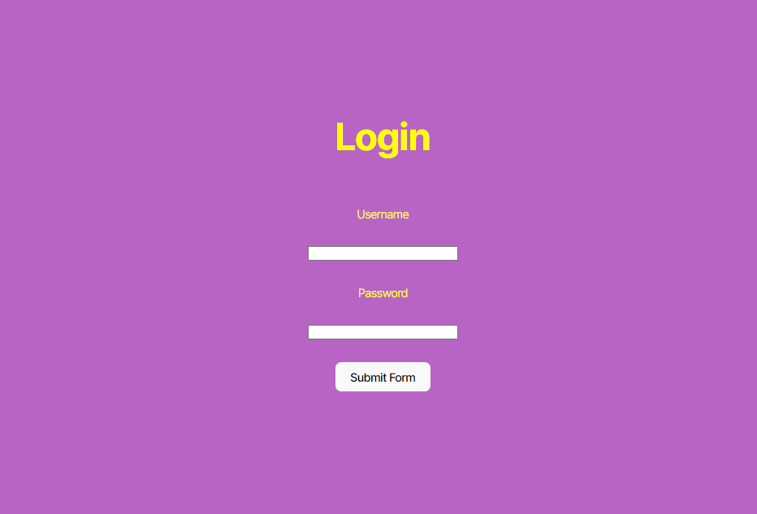
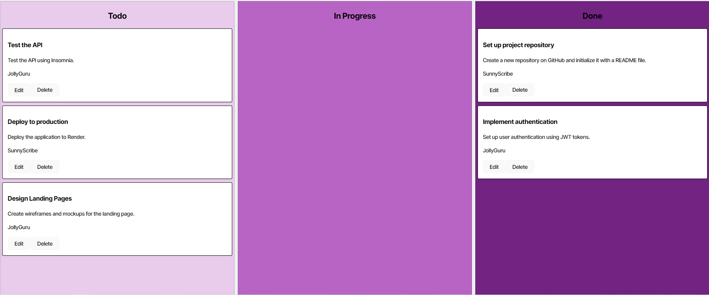

# Kanban-Board

### Table of Contents
- [Description](#description)
- [How to Install](#how-to-install)
- [Usage](#usage)
- [License](#license)
- [Contributors](#contributors)
- [Questions](#questions)
- [Website Images](#website-images)

---

---

## Description

This website was created to show how loggin into a server works and authentication of the Users information. Upon logging in, you are met with a screen that allows for putting data into three different categores:

To-do  
In Progress  
Done

You are able to edit or delete information within any of the categories alongside creating a new ticket.

---

## How to Install

Here is the official website: https://kanban-board-qdho.onrender.com

You can also see the project on your local computer using these steps:

npm install  
npm run build  
npm seed  
npm run start  

And going to the website that has been started on https://localhost:3001

Make sure you create a .env file in the root directory with this information:  
DB_NAME='DATABASE NAME'  
DB_USER='YOUR POSTGRES USERNAME'  
DB_PASSWORD='YOUR POSTGRES PASSWORD'  
JWT_SECRET_KEY='YOUR SECRET KEY'  

---

## Usage

This website is used to login to a Kanban Board and see lists created by each user as a whole, It is used to show off how Logging into a server is processed and authenticated. 

---

## License

For more information about the MIT license, use this link!
 https://memgraph.com/blog/what-is-mit-license

For a better understanding, I give you permission to use, copy, modify, distribute and sell copies at your own discretion.

---

## Contributors

University Of Utah Coding Bootcamp and Cameron Barfuss

Specifically, The coding bootcamp has taught different code elements to use to be able to create a functioning website, I wrote the code relating to the users login authentication while the rest was given by the University of Utah Coding Bootcamp.

---

## Questions

My Github: https://github.com/Runnerrupert

My Email Address: Cameron.barfuss@gmail.com

You can contact me using my Github link or via Email if you have any questions about Kanban-Board.

--

## Website Images

  

